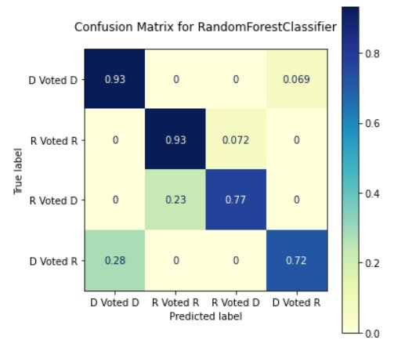
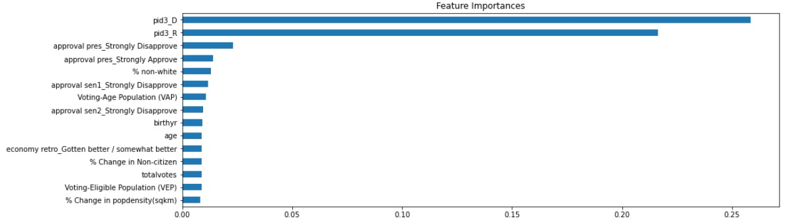
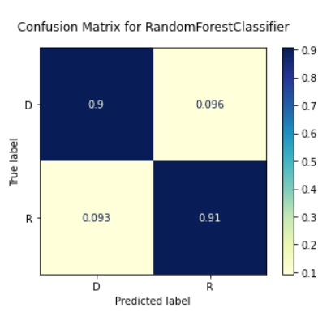
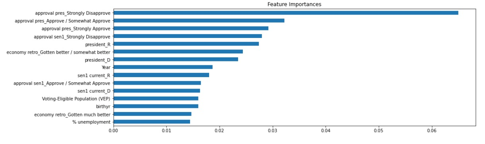

# Predicting Voter Choice in Senate Races

## Abstract 

Although control of the Senate has always been an important goal for both major parties, 2020 has thrown this battle into the spotlight. Because of the importance of these races, it might be useful to know if a person's vote can be predicted by gathering information about them and their state. To answer this questions we gathered demographic, economic, and election information for all states from various sources with a previously conducted survey of voters. Data were collected from a variety of sources. We set out to predict whether someone registered with one of the two major parties would defect and how independents would vote. In both cases, a random forest model was the most accurate. 

We can achieve 92% accuracy in predicting whether registered Democrats and Republicans will vote with their party in Senate races and 91% accuracy in predicting which candidate people registered with each party voted for. While in both cases having a higher population and being younger was associated with voting for a Democrat and views of other elected officials were very influential, there were some differences. For major-party-affiliated voters, a higher percentage of non-white individuals living in their state and increased population density and percentage of non-citizens was associated with Democrats defecting to the Republican party while the opposite was true for Democrats who voted for a Republican. Meanwhile unemployment was a significant factor with independent voters, who typically voted for Republicans when unemployment was high.     

## Business Problem

Being able to predict why certain voters vote in certain ways can inform campaigns how to more efficiently target the kind of voters who would be more likely to vote for them.  

## Data

There was a large compilation of state policy and demographic variables made available by the Michigan State University that was used in this project. Senate data by year and voting eligible population data was found on data.world. However there was not consistent data across years. For population level variables, we turned mostly to the Census Bureau, sorting through their tables from each year. However we also used data from the Kaiser Family Foundation, the Congressional Research Service, Iowa State University, and Harvard’s dataverse to fill in missing data. We also used a large-scale survey of voters in the Harvard dataverse.

Some variables, such as which places were impacted by the Supreme Court case Shelby v Holder, were not available in the form of a data table and simply researched to understand which states were affected and what impact the case had on these states’ elections. Other variables, such as each state’s policy on voter ID and other such laws in recent years, had to be manually inputted. Thanks to various news articles and the National Conference of State Legislatures, we were able to pinpoint when changes in the laws occurred and input the data accordingly. In addition we scrapped unemployment data that had not being compiled and put in a downloadable form from the U.S. Bureau of Labor Statistics.

All data is linked when used and sources are cited for the appropriate works at the bottom of this document and the notebook.

## Methods

After combining the data using pandasql, we analyzed it using logistic regressin, random forest, XGBoost, and voting classifier models. We took the best models for each question and examined feature importances. 

## Results

Using a random forest model with tuned hypterparameters, we were able correctly classify Democrats who would vote with their party, Republicans who would vote with their party, Democrats who voted for Republicans, and Republicans who voted for Democrats with 92% accuracy.  

The model correctly predicted people voting with their party 93% of the time, Republicans who voted for the Democratic candidate 77% of the time, and Democrats who voted for the Republican candidate 72% of the time.

The model identified the 15 most influential features, which include the person's party and presidential approval.

Using a random forest model with tuned hypterparameters, we were able predict the voting choice of voters who did not identify with either party 91% accurately. 

The model correctly predicted those who voted for Democrats 90% of the time and those who voted for Republicans 91% of the time.

The model identified the 15 most influential features, which include presidential and senator approval.

## Recomendations

<ul>
<li>Democrats should prioritize voters in states with a higher percentage of non-white individuals and greater numbers of voting-age and voting-eligible because they are more likely to be potential voters while Republicans should focus on the opposite.</li>
<li> Likewise Democrats should focus on states where population density and the percentage of non-citizens is going up.</li>
<li>Focus on unemployment is a strong position for Republicans. Democrats need to present a stronger case to swing voters when unemployment is going up.</li>
<li>Both parties must find ways to mitigate the impact of disapproval of the president and their other senator when their party is in power.</li>  
</ul>

## Limitations

<ul>
<li>We did not examine variables that are related to individuals choosing to vote or not to vote, a crucial factors in winning elections.</li>
<li>Many of the variables in the Correlates of State Policy Project did not cover the time period we were examining so it is possible we left out an important variable.</li>
<li>We did not have access to see how the same people voted over time, which might provide further insights.</li>
<li>In the future it might be useful to only examine states where Senate seats are likely to flip or have in the past flipped.</li> 
<li>There are still some unexplained important features.</li>
</ul>

## References

<ul>
<li>Kuriwaki, Shiro, 2020, "Cumulative CCES Common Content", https://doi.org/10.7910/DVN/II2DB6, Harvard Dataverse, V5
Kelly, Nathan J., and Christopher Witko. “Government Ideology and Unemployment in the U.S. States.” State Politics &amp; Policy Quarterly 14.4 (2014): 389–413.</li>
<li>Klarner, Carl, 2013, “State Economic Data”, https://doi.org/10.7910/DVN/KMWN7N, Harvard Dataverse, V1
University of Kentucky Center for Poverty Research. 2019. “UKCPR National Welfare Data, 1980-2017.” Lexington, KY. http://ukcpr.org/resources/national-welfare-data</li>
<li>Iowa Community Indicators Program. 2019. "Annual Unemployment Rates by State." Ames, IA. https://www.icip.iastate.edu/tables/employment/unemployment-states</li>
<li>Caughey, Devin, and Christopher Warshaw. 2015. “The Dynamics of State Policy Liberalism, 1936–2014.” American Journal of Political Science, September. doi: 10.1111/ajps.12219. https://dataverse.harvard.edu/dataset.xhtml?persistentId=doi:10.7910/DVN/ZXZMJB</li>
<li>Klarner, Carl, 2013, “Governors Dataset”, https://doi.org/10.7910/DVN/PQ0Y1N, Harvard Dataverse, V1</li>
<li>Biggers, Daniel R., and Michael J. Hanmer. “Understanding the adoption of voter identification laws in the American states.” American Politics Research 45.4 (2017): 560-588.</li>
<li>Frederick J. Boehmke; Mark Brockway; Bruce Desmarais; Jeffrey J. Harden; Scott LaCombe; Fridolin Linder; Hanna Wallach, 2018, “State Policy Innovation and Diffusion (SPID) Database v1.0”, https://doi.org/10.7910/DVN/CVYSR7</li>
<li>Boehmke, Frederick J., and Paul Skinner. “State policy innovativeness revisited.” State Politics &amp; Policy Quarterly 12.3 (2012): 303-329.</li>
<li>Kelly, Nathan J., and Christopher Witko. “Government Ideology and Unemployment in the U.S. States.” State Politics &amp; Policy Quarterly 14.4 (2014): 389–413.</li>
<li>Brian Schaffner; Stephen Ansolabehere; Sam Luks, 2019, "CCES Common Content, 2018", https://doi.org/10.7910/DVN/ZSBZ7K, Harvard Dataverse, V6, UNF:6:hFVU8vQ/SLTMUXPgmUw3JQ== [fileUNF]</li>
<li>Stephen Ansolabehere, 2010, "CCES Common Content, 2006", https://doi.org/10.7910/DVN/Q8HC9N, Harvard Dataverse, V4, UNF:5:Zz4+e5bz7lzeLOjQCUk+lw== [fileUNF]</li>
<li>The Pew Charitable Trusts; Pettigrew, Stephen; Stewart, Charles, 2013, "Essential Files to Generate Pew Elections Performance Index", https://doi.org/10.7910/DVN/WOV3HY, Harvard Dataverse, V12</li>
<li>MIT Election Data and Science Lab, 2017, "U.S. Senate 1976–2018", https://doi.org/10.7910/DVN/PEJ5QU, Harvard Dataverse, V4, UNF:6:WzSZLQX8O9Nk6RKWwkjx9g== [fileUNF]</li>
</ul>